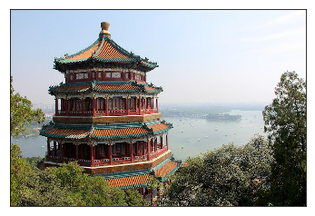
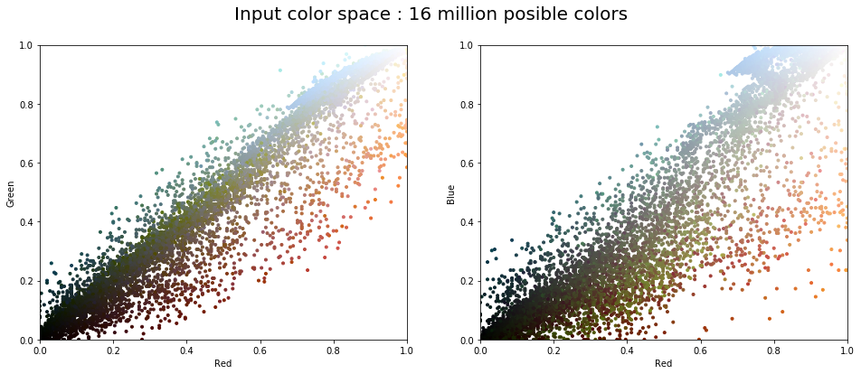
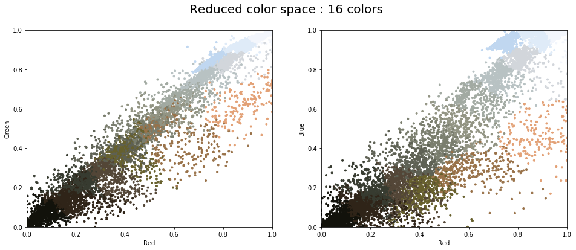
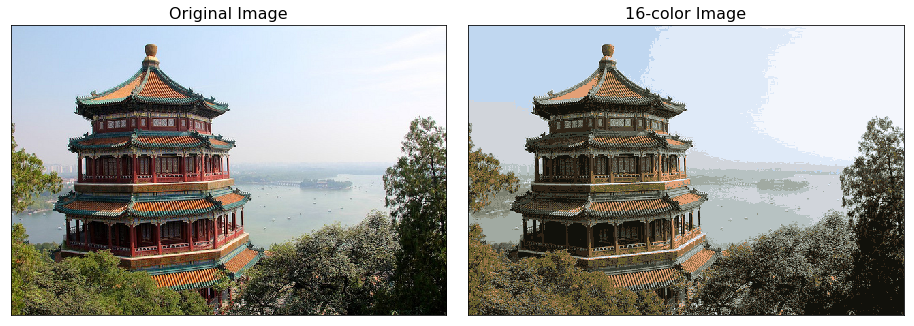

# image color compression kmeans clustering

Color compression of an image with K-Means Clustering Algorithm which can help in devices with low processing power and memory for large images

## Visualizing Image before processing

## Visualizing Input color space : 16 million possible colors

## Visualizing Reduced color space : 16 colors

## Visualizing Final Image Output and Original

